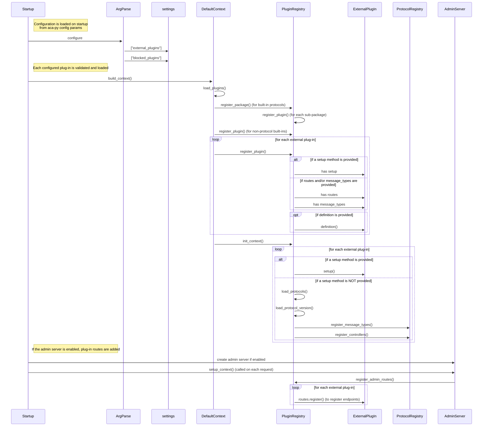

# Deeper Dive: Aca-Py Plug-Ins

## Loading Aca-Py Plug-Ins at Runtime

Plug-ins are loaded on Aca-Py startup based on the following parameters:

* `--plug-in` - identifies the plug-in library to load
* `--block-plugin` - identifies plug-ins (includign built-ins) that are *not* to be loaded
* `--plugin-config` - identify a configuration parameter for a plug-in
* `--plugin-config-value` - identify a *value* for a plug-in configuration

The load sequence for a plug-in (the "Startup" class depends on how Aca-Py is running - `upgrade`, `provision` or `start`):

## What's in a Plug-In and How does it Work?

### Plug-Ins V1

### Plug-Ins V2

## Developing a New Plug-In

### Plug-Ins V1

### Plug-Ins V2

### PIP vs Poetry Support

### Plug-In Demo

## Enhancements

- on startup (after loading plug-ins) and on shutdown
- register events (on event bus)
- add inbound and outbound transports
- add data stores (wallets) and ledgers
- add implementation of other providers
- customize admin server/api behaviour
- pre- and post- on admin api calls (by protocol or global)
- pre- and post- on message receipt
- pre- and post- on message send
- pre- and post- on send webhook
- unload plug-in (may do a one-time operation)
- credential types - issue, hold, verify, prove, etc. (separate from cred/proof exch protocols)

- plug-in versioning (separate from protocol versioning)
- how to ensure plug-ins don't conflict
   - avoid plug=ins modifying other protocols or plug-ins
- testing
   - add plug-ins to aca-py integration tests and/or AATH (regression tests)
   - plug-in test framework (add plug-in specific tests)
- plug-in registry (could be a github registry that *also* includes the test framework)

## Existing Aca-Py Plug-Ins

[Hackmd.io doc](https://hackmd.io/m2AZebwJRkm6sWgO64-5xQ)

## Reference

Configuration params:
  https://github.com/hyperledger/aries-cloudagent-python/issues/1121
  https://hackmd.io/ROUzENdpQ12cz3UB9qk1nA
  https://github.com/hyperledger/aries-cloudagent-python/pull/1226

Loading plug-ins:
  https://github.com/hyperledger/aries-cloudagent-python/pull/1086

Loaded by default context here:
  https://github.com/hyperledger/aries-cloudagent-python/blob/main/aries_cloudagent/config/default_context.py

Registered admin routes here:
  https://github.com/hyperledger/aries-cloudagent-python/blob/main/aries_cloudagent/admin/server.py#L451

Versioning for plug-ins:
  https://github.com/hyperledger/aries-cloudagent-python/pull/443

